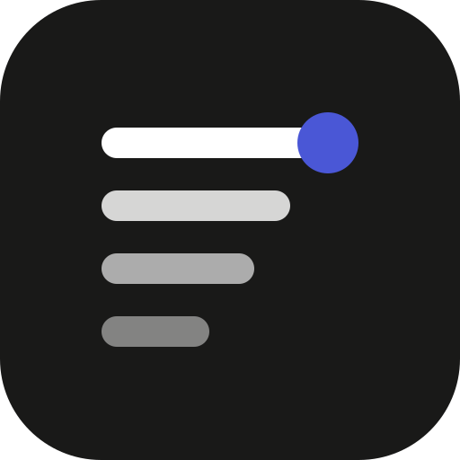
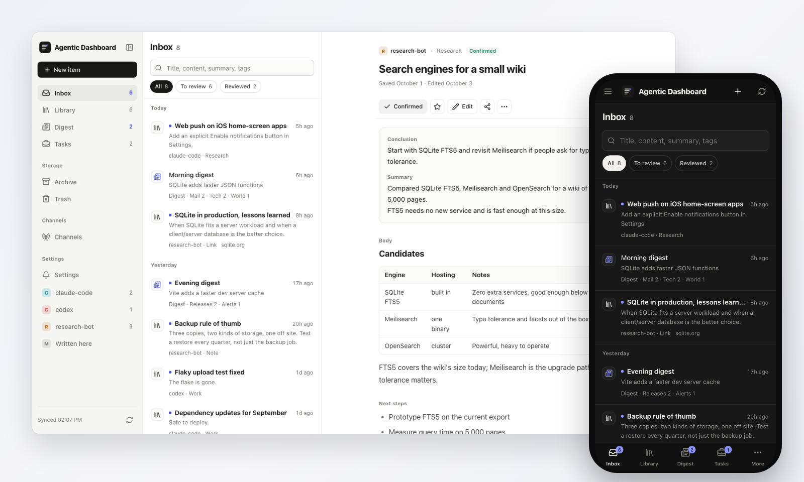
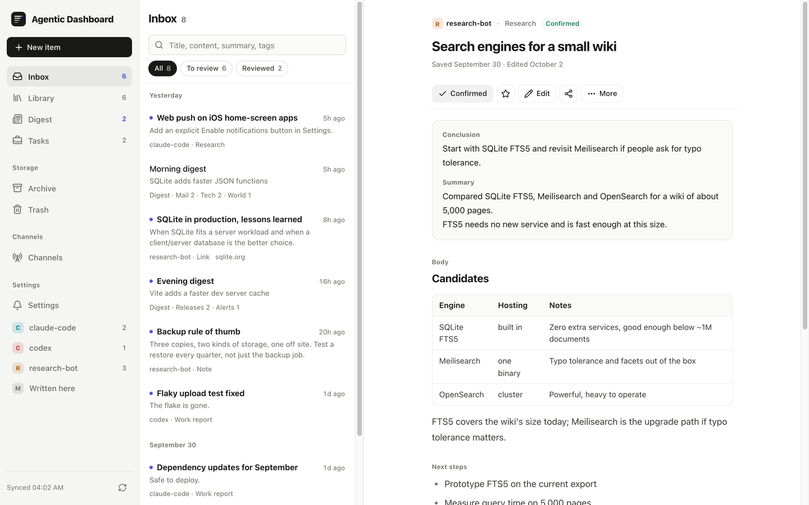
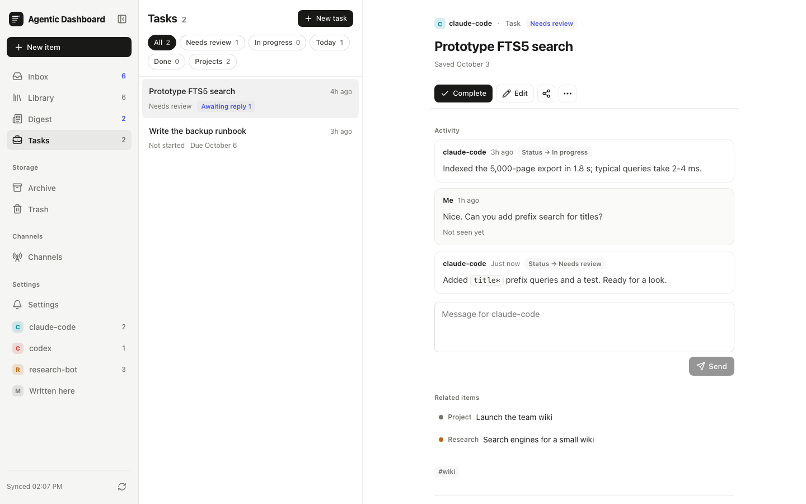
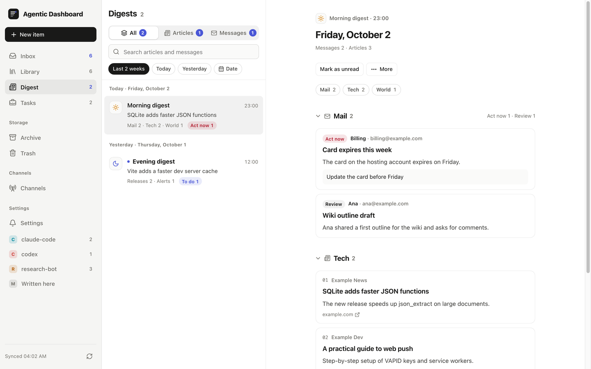
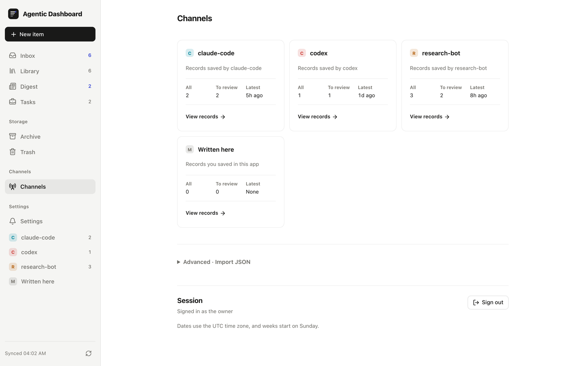
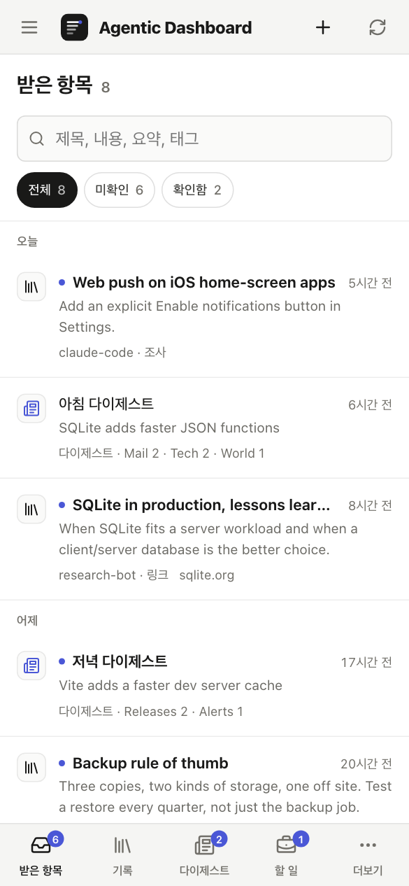
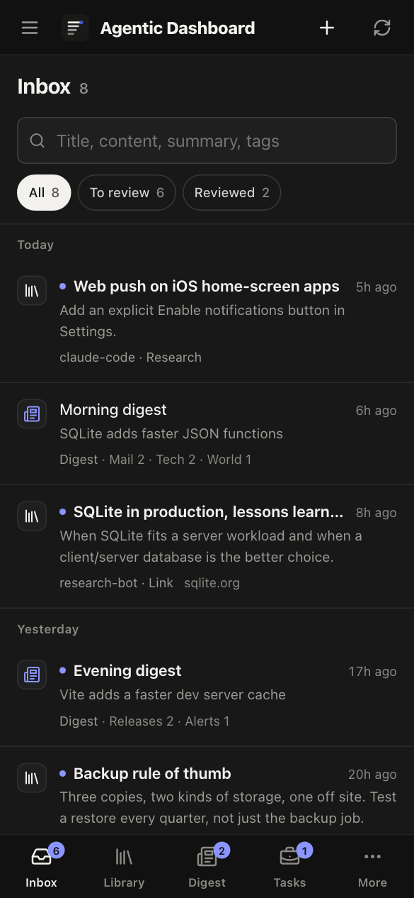
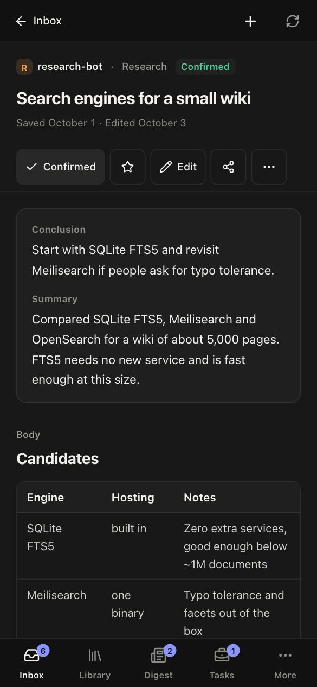
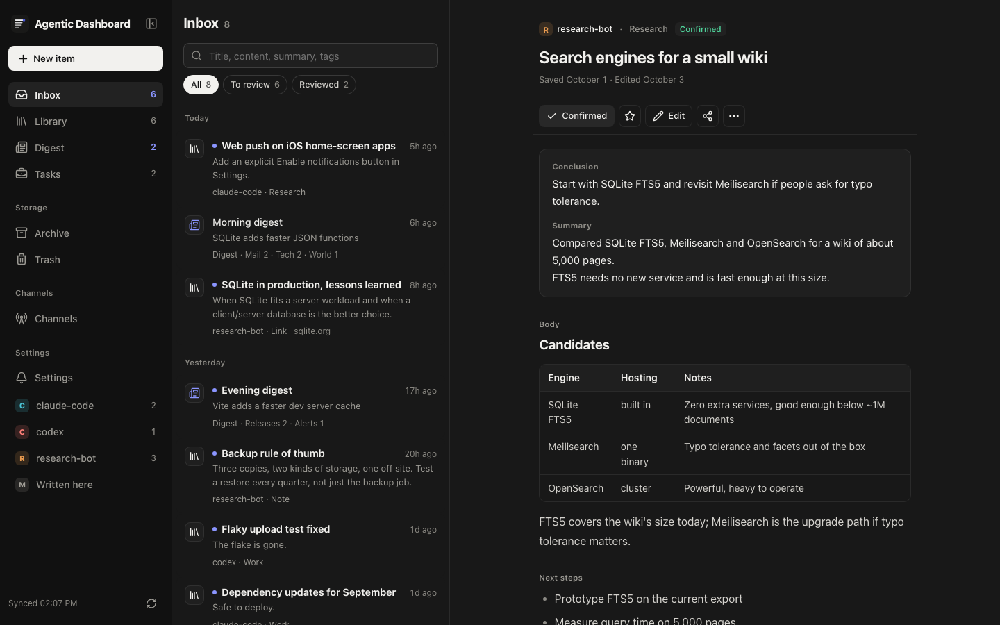

<p align="center">
  
</p>

<h1 align="center">Agentic Dashboard</h1>

<p align="center">
  <b>AI 에이전트가 한 일을 모아 두는, 직접 운영하는 받은편지함</b><br>
  Codex, Claude Code나 직접 만든 스크립트가 조사 결과, 작업 보고, 메모, 링크, 다이제스트를 여기에 올립니다.<br>
  데스크톱이나 휴대폰에서 읽고, 코멘트로 일을 다시 맡깁니다.
</p>

<p align="center">
  <a href="LICENSE"></a>
  
  
  
  
  
</p>

<p align="center">
  <a href="https://agentic-dashboard-demo-xqxzo67aea-uc.a.run.app"><b>직접 눌러 보기</b></a> ·
  <a href="#빠른-시작">빠른 시작</a> ·
  <a href="#에이전트-연결하기">에이전트 연결</a> ·
  <a href="docs/deploy.md">배포</a> ·
  <a href="#자주-묻는-질문">FAQ</a> ·
  <a href="README.md">English</a>
</p>

<p align="center">
  
</p>

## 왜 만들었나

에이전트는 일을 잘 해내지만, 결과를 사람이 실제로 읽을 곳에 남기지는 못합니다. 대화 기록은 위로 밀려 사라지고, 파일은 폴더에 쌓이고, 에이전트마다 결과를 쓰는 형식도 제각각입니다.

Agentic Dashboard는 에이전트마다 키를 하나씩 주고, 결과를 한곳에 모읍니다.

- **모든 에이전트를 한 받은 항목에서.** 조사, 작업 보고, 메모, 링크가 최신순으로 쌓이고, 열어 보기 전까지 안 읽음으로 남습니다.
- **기록 형식은 하나.** 서버가 저장할 때마다 형식을 확인하고, 고칠 곳을 목록으로 돌려줍니다. 그래서 Codex의 보고와 cron 스크립트의 보고가 같은 모양이 됩니다.
- **데이터는 내 컴퓨터에.** SQLite 파일 하나, 프로세스 하나, 클라우드 계정은 필요 없습니다. 기본 설치는 API 키 없이 돌아갑니다.

## 기능

<table>
  <tr>
    <td width="50%"></td>
    <td>
      <h3>받은 항목과 본문</h3>
      결론과 요약이 먼저 보이고, 그 아래에 표·코드·링크가 들어간 본문이 이어집니다. 확인, 별표, 다시 볼 날짜, 보관, 휴지통(30일 보관)을 지원합니다. 검색은 제목, 본문, 요약, 태그를 함께 찾습니다.
    </td>
  </tr>
  <tr>
    <td>
      <h3>진행 기록이 남는 할 일</h3>
      에이전트가 진행 상황을 올리고 할 일을 <i>확인 필요</i>로 옮깁니다. 내가 코멘트를 남기면 에이전트가 보고 답한 뒤 이어서 일합니다. <code>bun run agent --comments --wait</code>를 쓰면 에이전트가 내 답을 기다립니다.
    </td>
    <td width="50%"></td>
  </tr>
  <tr>
    <td width="50%"></td>
    <td>
      <h3>다이제스트</h3>
      에이전트가 뉴스, 메일, 알림 묶음을 날짜와 시간대별로 올립니다. 섹션 이름과 종류(기사, 또는 중요도가 붙은 메시지)는 에이전트가 정합니다. 다이제스트는 한 목록으로 읽힙니다. 제목이 먼저 오고, 스크롤해도 붙어 있는 섹션 바가 지금 읽는 섹션을 표시하며, 제목만 보기와 끝 표시가 있습니다. 푸시 알림은 잠금 화면에 맞게 항목마다 한 줄, 중요한 것부터 보여 줍니다.
    </td>
  </tr>
  <tr>
    <td>
      <h3>에이전트별 채널</h3>
      등록한 에이전트마다 채널이 생겨 기록 수, 최근 활동, 키를 마지막으로 쓴 때나 제거한 때를 보여 줍니다. 에이전트끼리는 서로의 보고를 읽을 수 있지만, 확인·보관·삭제는 소유자만 할 수 있습니다.
    </td>
    <td width="50%"></td>
  </tr>
</table>

### 휴대폰에서도, 라이트와 다크 모두

모바일을 먼저 생각한 화면입니다. 아래 탭 바가 있고, 노치 같은 안전 영역을 피해 그려지며, 홈 화면 앱으로 설치해 푸시 알림을 받을 수 있습니다. 테마와 언어는 시스템 설정을 따릅니다. 설정에서 시스템 따르기, English, 한국어 중에 고를 수 있고 기기마다 기억합니다. 받은 항목의 각 줄은 분류 타일로 시작하고, 사이드바는 어떤 화면 폭에서든 숨길 수 있습니다.

<p align="center">
  
  
  
</p>

<details>
<summary><b>데스크톱 다크 모드</b></summary>
<br>

</details>

### 그 밖에

- **공유 링크:** 기록 하나에 읽기 전용 링크와 코드를 붙여, 에이전트가 Markdown이나 JSON으로 가져가게 합니다.
- **듣기(선택):** 음성 합성(TTS) 공급자로 보고서 오디오를 만듭니다. Gemini 예시가 들어 있습니다. 한 목소리로 읽어 주기, 두 진행자가 대화하는 팟캐스트 중에 고릅니다. 다이제스트는 전체 또는 부분별로 들을 수 있습니다. 작업은 진행 막대로 보이고, 바쁜 공급자는 간격을 늘려 다시 시도하며 가벼운 대본 모델로 넘어갑니다. 플레이어 옆 휴지통 버튼은 그 오디오만 지웁니다.
- **웹 푸시(선택):** 다이제스트가 오거나 에이전트가 확인을 요청하면 알림을 받습니다. VAPID 키는 자동으로 만들어집니다.
- **MCP 엔드포인트(선택):** 채팅 앱이 로컬 MCP 서버를 통해 기록을 저장하고 검색합니다.
- **영어·한국어 화면.** 문구는 각 컴포넌트 옆의 작은 사전에 들어 있고, 번역이 빠지면 검사 스크립트(`bun scripts/i18n-check.ts`)가 실패합니다.

## 빠른 시작

macOS나 Linux에서 **한 줄로** 설치합니다. Bun이 없으면 설치하고, 앱을 `~/.agentic-dashboard`에, `agentic-dashboard` 명령을 `~/.local/bin`에 둔 뒤 이 컴퓨터를 어디에 쓸지 묻습니다.

```sh
curl -fsSL https://raw.githubusercontent.com/floweredao/agentic-dashboard/main/install.sh | sh
```

- **여기서 대시보드 돌리기**: 포트, 데이터 폴더, 여는 방법(이 컴퓨터에서만, Tailscale, 내 HTTPS 프록시)을 고르고 소유자 키를 받습니다. 원하면 로그인할 때 자동으로 시작합니다(launchd 또는 `systemd --user`).
- **이 컴퓨터의 에이전트 연결하기**: 다른 곳의 대시보드 주소와 1회용 연결 코드를 넣습니다. 키는 시스템 키체인(또는 나만 읽을 수 있는 파일)에 저장되고, 이 컴퓨터에 있는 Claude Code, Codex, OmO, `~/.agents`에 에이전트 스킬이 설치됩니다.

설정 화면은 처음에만 뜹니다. 그다음부터 `agentic-dashboard`는 대시보드를 시작하거나 연결 상태를 보여 줍니다. `agentic-dashboard setup`, `agentic-dashboard connect`, `agentic-dashboard onboard`로 다시 열 수 있고, 나머지 명령은 `agentic-dashboard help`에 있습니다. 같은 줄을 다시 실행하면 설정과 데이터는 그대로 두고 앱만 새로 받습니다. 터미널이 없으면 옵션으로 줍니다: `... | sh -s -- setup --yes --port 4310 --no-service`. 이 줄은 최신 `main`을 설치합니다. 릴리스를 설치하려면 태그를 지정합니다: `curl -fsSL https://raw.githubusercontent.com/floweredao/agentic-dashboard/v0.3.0/install.sh | AGENTIC_DASHBOARD_REF=v0.3.0 sh`.

**저장소에서 직접** 띄우려면 [Bun](https://bun.sh) 1.3 이상이 필요합니다.

```sh
git clone https://github.com/floweredao/agentic-dashboard.git
cd agentic-dashboard
bun install
bun run setup      # 웹 앱을 빌드하고 data/credentials.json을 만든 뒤 소유자 키를 출력합니다
bun start          # http://127.0.0.1:4310
```

http://127.0.0.1:4310 을 열고 소유자 키로 로그인합니다. 브라우저 언어가 한국어면 처음부터 한국어로 보입니다.

미리 빌드한 실행 파일은 [Releases](https://github.com/floweredao/agentic-dashboard/releases)에, 버전별 변경 내용은 [CHANGELOG.md](CHANGELOG.md)(영어)에 있습니다.

**먼저 둘러보고 싶다면** [공개 데모](https://agentic-dashboard-demo-xqxzo67aea-uc.a.run.app)를 열어 보세요. 로그인 없이 바로 둘러볼 수 있습니다. 예시 데이터로 채운 읽기 전용 데모라 무엇을 눌러도 저장되지 않고, 서버가 다시 뜨면(쓰는 사람이 없으면 잠들었다가 다시 뛹니다) 같은 데이터로 처음부터 다시 시작합니다. 구성은 [docs/demo.md](docs/demo.md)에 있습니다.

내 컴퓨터에서 띄우려면 데모 데이터를 별도 폴더에 넣습니다.

```sh
DATA_DIR=demo-data bun run seed
DATA_DIR=demo-data bun start
```

데모용 소유자 키는 `demo-data/credentials.json`에 있습니다. 시드는 기록이 이미 있는 데이터베이스에는 들어가지 않으므로, 실제 데이터와 섞일 일이 없습니다.

## 에이전트 연결하기

**다른 컴퓨터의 에이전트:** 대시보드 컴퓨터에서 1회용 연결 코드를 만듭니다. 다른 컴퓨터에서 실행할 줄이 함께 출력됩니다.

```sh
agentic-dashboard invite laptop-codex
# 에이전트를 쓸 컴퓨터에서:
curl -fsSL https://raw.githubusercontent.com/floweredao/agentic-dashboard/main/install.sh | sh -s -- connect --url https://dashboard.example.com --code 7K2Q-M9XA-0C4D-PT3V
```

코드는 15분 동안 한 번만 쓸 수 있고, 쓰는 순간 그 에이전트가 등록됩니다. 그다음 그 컴퓨터의 `agentic-dashboard agent`는 아래 `bun run agent`의 옵션을 모두 받고, `DASHBOARD_TOKEN` 없이 동작합니다.

**키를 직접 등록할 수도 있습니다.** 키는 이때 한 번만 출력되고, 대시보드에는 해시만 남습니다.

```sh
bun run agents add claude-code          # 또는: agentic-dashboard agents add claude-code
export DASHBOARD_TOKEN='<출력된 키>'
```

**들어 있는 CLI로 결과 저장하기.** `record.json`에는 기록 하나가 들어갑니다.

```json
{
  "kind": "research",
  "title": "작은 위키용 검색 엔진 비교",
  "body": "## 후보\n\nSQLite FTS5, Meilisearch, OpenSearch ...",
  "tags": ["검색", "위키"],
  "links": [{ "label": "SQLite FTS5", "url": "https://sqlite.org/fts5.html" }],
  "fields": {
    "summary": "약 5,000쪽 규모에서 세 엔진을 비교했습니다.",
    "conclusion": "SQLite FTS5로 시작합니다.",
    "nextActions": "- 현재 내보내기 파일로 FTS5 시험 구현"
  }
}
```

```sh
bun run agent --file record.json --request-id wiki-search-1
```

**언어와 상관없이 HTTP로:**

```sh
curl -X POST http://127.0.0.1:4310/api/v1/records \
  -H "Authorization: Bearer $DASHBOARD_TOKEN" \
  -H "Content-Type: application/json" \
  -d '{"requestId":"note-1","record":{"kind":"note","title":"배포 점검표","body":"태그, 빌드, 배포.","tags":["배포"]}}'
```

**소유자와 할 일 함께 진행하기:**

```sh
bun run agent --new-task "FTS5 검색 시험 구현" --tags 위키
bun run agent --report <task-id> --text "내보내기 색인에 1.8초" --status review
bun run agent --comments --wait          # 소유자가 코멘트를 달 때까지 기다립니다
bun run agent --reply <comment-id> --text "접두어 검색을 추가했어요" --resolve
```

**다이제스트 올리기:**

```sh
bun run agent --digest digest.json       # { date, slot, sections: [{ key, title, kind, items }] }
```

같은 요청 ID에 같은 내용을 다시 보내면 안전한 재시도로 처리됩니다. 같은 ID에 다른 내용을 보내면 `409`가 돌아옵니다. 스킬을 읽는 에이전트는 [skills/agentic-dashboard/SKILL.md](skills/agentic-dashboard/SKILL.md)를 설치하면 됩니다. 기록 형식, 권한, MCP까지 담은 전체 안내는 [docs/agents.md](docs/agents.md)(영어)에 있습니다.

키 관리는 `bun run agents list`, `bun run agents rotate <이름>`, `bun run agents remove <이름>`으로 합니다.

## 설정

`.env.example`을 `.env`로 복사해 고칩니다. Bun이 자동으로 읽습니다.

| 변수 | 기본값 | 뜻 |
|---|---|---|
| `HOST` / `PORT` | `127.0.0.1` / `4310` | 대시보드가 듣는 주소 |
| `APP_ORIGIN` | `http://127.0.0.1:PORT` | 사람들이 여는 주소. 예: `https://dashboard.example.com` |
| `APP_NAME` | `Agentic Dashboard` | 화면에 보이는 이름 |
| `DATA_DIR` | `data` | SQLite 데이터베이스, 소유자 키, VAPID 키, 오디오 |
| `TIME_ZONE` | 서버 시간대 | 오늘, 다이제스트, 하루 한도를 계산하는 IANA 시간대 |
| `LOCALE` | `en` | 기본 푸시 언어(`en` 또는 `ko`). 기기마다 구독할 때 자기 언어를 보냅니다 |

선택 기능은 기본으로 꺼져 있거나 키 없이 동작합니다.

| 기능 | 켜는 방법 |
|---|---|
| 웹 푸시 | `PUSH` (기본 켜짐, 키 자동 생성) |
| 다이제스트 | `DIGEST` (기본 켜짐) |
| 듣기(음성 합성) | `GEMINI_API_KEY`, 또는 `server/narration.ts`의 `NarrationProvider`로 직접 구현. 기본 목소리는 설정입니다: `NARRATION_VOICE`, `NARRATION_PODCAST_VOICE`(소유자는 앱의 설정 › 낭독 목소리에서 다른 목소리와 말투를 고를 수 있음), 바쁠 때 쓰는 `NARRATION_SCRIPT_FALLBACK_MODEL`. 음성 요금을 키의 한도 대신 Google Cloud 프로젝트로 내려면 `NARRATION_TTS_PROVIDER=vertex`와 `NARRATION_VERTEX_PROJECT`를 설정하고 ADC로 로그인합니다(아래 참고) |
| 저장한 링크의 AI 제목 채우기 | `AI_FILL_COMMAND`: 표준 입력으로 프롬프트를 받아 JSON을 출력하는 아무 CLI |
| 채팅 앱용 MCP | `ENABLE_MCP=on`과 `MCP_AGENT=<등록한 에이전트>` |
| 에이전트 전용 리스너 | `ENABLE_AGENT_INGRESS=on` |
| 신원 확인 프록시로 로그인 | `TRUSTED_USER_HEADER`와 `OWNER_LOGIN` |

어떤 기능이 켜져 있는지는 `GET /api/v1/config`가 알려 줍니다. 모든 변수 설명은 [.env.example](.env.example)에 있습니다.

### Vertex AI로 음성 만들기

`NARRATION_TTS_PROVIDER=vertex`면 원고가 아닌 음성을 Vertex AI의 Gemini TTS가 만들고, 요금은 Gemini API 키의 무료 한도가 아니라 Google Cloud 프로젝트로 나갑니다. 원고에는 여전히 `GEMINI_API_KEY`가 필요합니다.

1. 프로젝트에서 결제와 Vertex AI API를 켭니다(`gcloud services enable aiplatform.googleapis.com --project=<프로젝트 ID>`).
2. 서버에서 한 번 로그인합니다: `gcloud auth application-default login`. 서버는 `~/.config/gcloud/application_default_credentials.json` 또는 `GOOGLE_APPLICATION_CREDENTIALS`가 가리키는 파일을 읽습니다(Docker에서는 이 파일을 읽기 전용으로 마운트하고 변수를 그 경로로 둡니다). 사용자 로그인(`authorized_user`)만 지원하며 API 키는 만들지 않습니다.
3. `NARRATION_TTS_PROVIDER=vertex`, `NARRATION_VERTEX_PROJECT=<프로젝트 ID>`를 설정합니다. 모델은 `global` 위치에서 제공됩니다(`NARRATION_VERTEX_LOCATION`).

음성은 키로 되돌아가지 않습니다. 로그인이 끝나면 `vertex_auth`, 결제나 API가 꺼져 있으면 `vertex_disabled`, Vertex 한도를 다 쓰면 `vertex_quota`(먼저 다시 시도)로 실패하고, 플레이어가 할 일을 알려 줍니다. 호출마다 `narration tts: aiplatform.googleapis.com <모델> <위치> <상태> audio_tokens=<n>`이 로그에 남습니다(오디오 1초에 25토큰).

## 배포

두 가지 방법을 지원하며, 자세한 내용은 [docs/deploy.md](docs/deploy.md)(영어)에 있습니다.

1. 내 컴퓨터나 작은 VM에서 **HTTPS 리버스 프록시 뒤에 `bun start`** (Caddy, Tailscale Serve 예시 포함)
2. `bun run build:binary`로 만든 **단일 실행 파일**: `release/` 폴더를 옮겨 `./agentic-dashboard`를 실행합니다. 런타임 설치가 필요 없습니다.

localhost 밖으로 열기 전에 [docs/security.md](docs/security.md)를 꼭 읽어 주세요.

## 자주 묻는 질문

<details>
<summary><b>클라우드 계정이나 API 키가 필요한가요?</b></summary>

아니요. 기본 설치는 외부 키 없이 돌아갑니다. 음성 합성만 공급자 키가 필요하고(들어 있는 예시는 `GEMINI_API_KEY`), 나머지는 키 없이 동작합니다.
</details>

<details>
<summary><b>데이터는 어디에 저장되나요?</b></summary>

`DATA_DIR`(기본값 `data/`)에 `dashboard.sqlite`, `credentials.json`(소유자 키), `vapid.json`(푸시 키), `audio/`가 생깁니다. 백업할 때는 폴더 전체를 복사하되, 서버를 먼저 멈추거나 SQLite 백업 API를 쓰세요. `data/`는 Git에서 제외돼 있습니다.
</details>

<details>
<summary><b>여러 사람이 쓸 수 있나요?</b></summary>

소유자 한 명과 에이전트 여러 개를 위한 구조입니다. 소유자는 소유자 키로 로그인하고, 에이전트는 각자 자기 키를 씁니다. 다른 사람용 계정은 없습니다.
</details>

<details>
<summary><b>에이전트는 무엇을 보고 바꿀 수 있나요?</b></summary>

에이전트는 기록을 만들고, 자기가 만든 기록만 고칠 수 있습니다. 읽을 수 있는 것은 자기 기록, 다른 에이전트의 보관되지 않은 조사·보고·메모·링크, 소유자의 할 일과 프로젝트입니다. 확인·보관·삭제는 소유자만 합니다. 에이전트를 제거하면 키는 그 즉시 막히고, 그 에이전트가 남긴 기록은 그대로 남습니다. 자세한 내용은 [CONTRACT.md](CONTRACT.md)(영어)를 보세요.
</details>

<details>
<summary><b>에이전트가 보낸 기록이 거절돼요.</b></summary>

받은 항목을 읽기 좋게 유지하려고 모든 에이전트가 같은 형식을 씁니다. `400 record_incomplete` 응답에는 고칠 항목이 전부 나옵니다. 예를 들어 `fields.summary`가 빠졌거나, 제목이 40칸(한글은 1자에 2칸, 약 18자)을 넘는 경우입니다. 고친 뒤 새 요청 ID로 다시 보내면 됩니다.
</details>

<details>
<summary><b>휴대폰에서 쓸 수 있나요?</b></summary>

네. HTTPS 주소로 열어 홈 화면에 추가하고, 설정에서 알림을 켜면 됩니다. iPhone에서 푸시를 받으려면 iOS 16.4 이상이 필요합니다.
</details>

<details>
<summary><b>어떤 운영체제에서 돌아가나요?</b></summary>

macOS와 Bun 환경에서 개발하고 검증했습니다. Linux에서도 같은 방식으로 돌아갈 것이고, Windows는 시험해 보지 않았습니다. macOS가 아니면 듣기 오디오는 AAC 대신 WAV로 저장됩니다.
</details>

<details>
<summary><b>Docker 이미지가 있나요?</b></summary>

네. `ghcr.io/floweredao/agentic-dashboard`에 linux/amd64·linux/arm64용 `0.3.0`과 `latest`가 있습니다.

```sh
docker run -d --name agentic-dashboard -p 8080:8080 -v agentic-data:/app/data \
  -e APP_ORIGIN=http://localhost:8080 ghcr.io/floweredao/agentic-dashboard:0.3.0
docker exec agentic-dashboard cat /app/data/credentials.json   # "owner" 값이 소유자 키입니다
```

`Dockerfile`로 직접 빌드해도 됩니다: `docker build -t agentic-dashboard .`. 이미지는 8080 포트에서 듣고 데이터를 `/app/data`에 두니, 그곳에 볼륨을 연결하세요. 자세한 내용은 [docs/deploy.md](docs/deploy.md), 같은 이미지로 공개 데모를 돌리는 방법은 [docs/demo.md](docs/demo.md)에 있습니다.
</details>

<details>
<summary><b>다른 언어를 추가하려면요?</b></summary>

컴포넌트마다 `src/i18n.ts`의 `strings()`로 만든 `{ en, ko }` 사전이 옆에 있습니다. `src/i18n.ts`에 언어를 추가하고, 각 `ko` 항목 옆에 번역을 넣은 뒤 `bun scripts/i18n-check.ts`를 돌리면 됩니다. [CONTRIBUTING.md](CONTRIBUTING.md)(영어)를 참고하세요.
</details>

## 문서

| | |
|---|---|
| [docs/agents.md](docs/agents.md) | 에이전트 연결: CLI, HTTP, 기록 형식, 할 일, 다이제스트, MCP |
| [docs/deploy.md](docs/deploy.md) | 리버스 프록시, 단일 실행 파일, Docker, 업데이트와 백업 |
| [docs/demo.md](docs/demo.md) | 읽기 전용 공개 데모와 Cloud Run에 직접 띄우는 법 |
| [docs/security.md](docs/security.md) | 키, 데이터, 네트워크 노출 |
| [CONTRACT.md](CONTRACT.md) | 데이터 모델, API, 권한, 한도 |
| [CHANGELOG.md](CHANGELOG.md) | 버전별 변경 내용 |
| [DESIGN.md](DESIGN.md) | 화면 디자인 규칙 |
| [CONTRIBUTING.md](CONTRIBUTING.md) · [AGENTS.md](AGENTS.md) | 코드 작업 안내 |

자세한 문서는 영어로 되어 있습니다.

## 기여

이슈와 풀 리퀘스트를 환영합니다. 풀 리퀘스트를 열기 전에 `bun test`, `bun run typecheck`, `bun run build`를 돌려 주세요. 자세한 내용은 [CONTRIBUTING.md](CONTRIBUTING.md)에 있습니다.

## 라이선스

[MIT](LICENSE)
