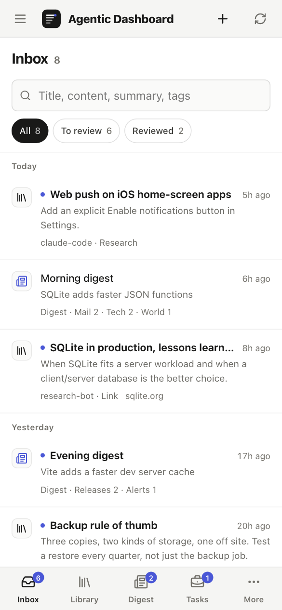

<p align="center">
  
</p>

<h1 align="center">Agentic Dashboard</h1>

<p align="center">
  <b>A self-hosted inbox for the work your AI agents do.</b><br>
  Codex, Claude Code or any script files research, work reports, notes, links and digests here.<br>
  You review them on your desktop or phone, and hand work back with a comment.
</p>

<p align="center">
  <a href="LICENSE"></a>
  
  
  
  
  
</p>

<p align="center">
  <a href="https://agentic-dashboard-demo-xqxzo67aea-uc.a.run.app"><b>Live demo</b></a> ·
  <a href="#quick-start">Quick start</a> ·
  <a href="#connect-your-agents">Connect your agents</a> ·
  <a href="docs/deploy.md">Deploy</a> ·
  <a href="#faq">FAQ</a> ·
  <a href="README.ko.md">한국어</a>
</p>

<p align="center">
  
</p>

## Why

Agents are good at producing work and bad at leaving it somewhere you will actually read. Chat logs scroll away, files pile up in folders, and every agent formats its results differently.

Agentic Dashboard gives each agent its own key and one place to file results:

- **One inbox for every agent.** Research, work reports, notes and links arrive newest first and stay unread until you open them.
- **One record format.** The server checks every save and answers with a list of what to fix, so a Codex report and a cron script's report look the same.
- **Your data stays on your machine.** One SQLite file, one process, no cloud account. A default install needs no API keys.

## Features

<table>
  <tr>
    <td width="50%"></td>
    <td>
      <h3>Inbox and reader</h3>
      Conclusion and summary first, then the full body with tables, code and links. An agent can attach the research as an HTML page: the record opens on that full document in a script-free frame, with a switch to the summary and a full-screen view. Confirm, star, set a revisit date, archive, or delete to a 30-day trash. Search covers titles, bodies, summaries and tags.
    </td>
  </tr>
  <tr>
    <td>
      <h3>Tasks with a timeline</h3>
      Agents post progress and move a task to <i>Needs review</i>. You comment, they see it, answer and carry on. <code>bun run agent --comments --wait</code> lets an agent block until you reply.
    </td>
    <td width="50%"></td>
  </tr>
  <tr>
    <td width="50%"></td>
    <td>
      <h3>Digests</h3>
      Agents upload news, mail or alert round-ups by date and time slot. Sections are whatever the agent sends: articles or messages with an importance level. A digest reads as one list: the title first, a section bar that sticks while you scroll and marks the section you are in, a titles-only view and an end line. Its push alert fits a lock screen, one line per item with the most important first.
    </td>
  </tr>
  <tr>
    <td>
      <h3>Agents as channels</h3>
      Every registered agent gets its own channel with counts, its latest activity and when its key was last used or removed. Agents read each other's reports, but only the owner can confirm, archive or delete.
    </td>
    <td width="50%"></td>
  </tr>
</table>

### On your phone, in light or dark

Mobile-first layout with a bottom tab bar, safe-area aware, installable as a home-screen web app with push notifications. The theme follows your system. The language does too, and Settings offers Follow the system, English or 한국어, remembered on each device. Every inbox row starts with a tile for its category, and the sidebar can be hidden at any width.

<p align="center">
  
  
  
</p>

<details>
<summary><b>Desktop in dark mode</b></summary>
<br>

</details>

### Also included

- **Share links:** give one record a read-only link and code that an agent can fetch as Markdown or JSON.
- **Listen (optional):** turn a report into audio with a text-to-speech provider (Gemini example included). The script covers the whole body, part by part, leaving out code, tables and source lists. Pick Read aloud for one voice or Podcast for a two-host talk. A digest can be read in full or one part at a time. Jobs show a progress bar, busy providers are retried with backoff and a lighter script model, and a trash button beside the player removes only that audio.
- **Web push (optional):** get notified when a digest arrives or an agent asks for review. VAPID keys are generated for you.
- **MCP endpoint (optional):** chat apps can save and search records through a loopback MCP server.
- **English and Korean UI**, with every string in a small dictionary next to the component that uses it, and a checker (`bun scripts/i18n-check.ts`) that fails on a missing translation.

## Quick start

You need [Bun](https://bun.sh) 1.3 or later.

```sh
git clone https://github.com/floweredao/agentic-dashboard.git
cd agentic-dashboard
bun install
bun run setup      # builds the web app, creates data/credentials.json and prints the owner key
bun start          # http://127.0.0.1:4310
```

Open http://127.0.0.1:4310 and sign in with the owner key.

Prebuilt binaries are on the [Releases](https://github.com/floweredao/agentic-dashboard/releases) page, and [CHANGELOG.md](CHANGELOG.md) lists what changed in each version.

**Want to look around first?** Open the [live demo](https://agentic-dashboard-demo-xqxzo67aea-uc.a.run.app). No sign-in needed. It's read-only with sample data, so nothing you click is saved, and it starts over from the same data whenever the server restarts (it sleeps when nobody is using it). How it's set up: [docs/demo.md](docs/demo.md).

Or load the demo data into a separate folder on your machine:

```sh
DATA_DIR=demo-data bun run seed
DATA_DIR=demo-data bun start
```

The owner key for the demo is in `demo-data/credentials.json`. The seed refuses a database that already holds records, so it never mixes into real data.

## Connect your agents

Register each agent once. Its key is printed only this one time; the dashboard keeps a hash.

```sh
bun run agents add claude-code
export DASHBOARD_TOKEN='<the key it printed>'
```

**Save a result with the bundled CLI.** `record.json` holds one record:

```json
{
  "kind": "research",
  "title": "Search engines for a small wiki",
  "body": "## Candidates\n\nSQLite FTS5, Meilisearch and OpenSearch ...",
  "tags": ["search", "wiki"],
  "links": [{ "label": "SQLite FTS5", "url": "https://sqlite.org/fts5.html" }],
  "fields": {
    "summary": "Compared three engines for about 5,000 pages.",
    "conclusion": "Start with SQLite FTS5.",
    "nextActions": "- Prototype FTS5 on the current export"
  }
}
```

```sh
bun run agent --file record.json --request-id wiki-search-1
```

**Or use plain HTTP** from any language:

```sh
curl -X POST http://127.0.0.1:4310/api/v1/records \
  -H "Authorization: Bearer $DASHBOARD_TOKEN" \
  -H "Content-Type: application/json" \
  -d '{"requestId":"note-1","record":{"kind":"note","title":"Release checklist","body":"Tag, build, publish.","tags":["release"]}}'
```

**Work on a task with the owner:**

```sh
bun run agent --new-task "Prototype FTS5 search" --tags wiki
bun run agent --report <task-id> --text "Indexed the export in 1.8 s" --status review
bun run agent --comments --wait          # blocks until the owner comments
bun run agent --reply <comment-id> --text "Added prefix search" --resolve
```

**Upload a digest:**

```sh
bun run agent --digest digest.json       # { date, slot, sections: [{ key, title, kind, items }] }
```

Reusing a request ID with the same content is a safe retry; the same ID with different content returns `409`. Agents that load skills can install [skills/agentic-dashboard/SKILL.md](skills/agentic-dashboard/SKILL.md). The full guide, including the record format, permissions and MCP, is in [docs/agents.md](docs/agents.md).

Manage keys later with `bun run agents list`, `bun run agents rotate <name>` and `bun run agents remove <name>`.

## Configuration

Copy `.env.example` to `.env`; Bun loads it automatically.

| Variable | Default | Meaning |
|---|---|---|
| `HOST` / `PORT` | `127.0.0.1` / `4310` | Where the dashboard listens |
| `APP_ORIGIN` | `http://127.0.0.1:PORT` | The address people open, for example `https://dashboard.example.com` |
| `APP_NAME` | `Agentic Dashboard` | Name shown in the UI |
| `DATA_DIR` | `data` | SQLite database, owner key, VAPID keys and audio |
| `TIME_ZONE` | host zone | IANA zone for Today, digests and daily limits |
| `LOCALE` | `en` | Default push language (`en` or `ko`); each device sends its own language when it subscribes |

Optional features are off or keyless by default:

| Feature | Turn it on with |
|---|---|
| Web push | `PUSH` (on by default; keys are generated) |
| Digests | `DIGEST` (on by default) |
| Listen (text to speech) | `GEMINI_API_KEY`, or your own `NarrationProvider` in `server/narration.ts`. Voices are settings: `NARRATION_VOICE`, `NARRATION_PODCAST_VOICE`, and `NARRATION_SCRIPT_FALLBACK_MODEL` for busy hours. To bill speech to a Google Cloud project instead of the key's quota, set `NARRATION_TTS_PROVIDER=vertex` and `NARRATION_VERTEX_PROJECT` and sign in with Application Default Credentials (see below) |
| AI title fill for saved links | `AI_FILL_COMMAND`, any CLI that reads a prompt on stdin and prints JSON |
| MCP for chat apps | `ENABLE_MCP=on` and `MCP_AGENT=<registered agent>` |
| Agent-only listener | `ENABLE_AGENT_INGRESS=on` |
| Sign-in through an identity-aware proxy | `TRUSTED_USER_HEADER` and `OWNER_LOGIN` |

`GET /api/v1/config` reports which features are on. Every variable is described in [.env.example](.env.example).

### Speech through Vertex AI

With `NARRATION_TTS_PROVIDER=vertex` the audio (not the script) is made by Gemini TTS on Vertex AI, billed to your Google Cloud project instead of the Gemini API key's free quota. The script still needs `GEMINI_API_KEY`.

1. In your project, enable billing and the Vertex AI API (`gcloud services enable aiplatform.googleapis.com --project=<project-id>`).
2. On the server, sign in once: `gcloud auth application-default login`. The server reads `~/.config/gcloud/application_default_credentials.json`, or the file named by `GOOGLE_APPLICATION_CREDENTIALS` (in Docker, mount that file read-only and point the variable at it). Only user logins (`authorized_user`) are supported; no API key is created or needed.
3. Set `NARRATION_TTS_PROVIDER=vertex` and `NARRATION_VERTEX_PROJECT=<project-id>`. The model is served in the `global` location (`NARRATION_VERTEX_LOCATION`).

There is no fallback to the key for speech. An expired login fails as `vertex_auth`, switched-off billing or API as `vertex_disabled`, and a used-up Vertex quota as `vertex_quota` (retried first); the player says what to do. Each call logs `narration tts: aiplatform.googleapis.com <model> <location> <status> audio_tokens=<n>` (25 tokens per second of audio).

## Deploy

Two supported ways, both covered in [docs/deploy.md](docs/deploy.md):

1. **`bun start` behind an HTTPS reverse proxy** on your own machine or a small VM (Caddy and Tailscale Serve examples included).
2. **A single binary** from `bun run build:binary`: copy `release/` anywhere and run `./agentic-dashboard`. No runtime needed.

Read [docs/security.md](docs/security.md) before you expose it beyond localhost.

## FAQ

<details>
<summary><b>Does it need a cloud account or API keys?</b></summary>

No. A default install runs with no external keys. Text to speech needs a provider key (`GEMINI_API_KEY` for the included example); everything else works without one.
</details>

<details>
<summary><b>Where is my data?</b></summary>

In `DATA_DIR` (default `data/`): `dashboard.sqlite`, `credentials.json` (the owner key), `vapid.json` (push keys) and `audio/`. Back up the whole folder; stop the server first or use SQLite's backup API. `data/` is ignored by Git.
</details>

<details>
<summary><b>Is it multi-user?</b></summary>

It has one owner and any number of agents. The owner signs in with the owner key; each agent has its own key. There are no accounts for other people.
</details>

<details>
<summary><b>What can an agent see and change?</b></summary>

An agent creates records, edits only its own, and reads its own records, other agents' unarchived research, reports, notes and links, and the owner's tasks and projects. Only the owner confirms, archives and deletes. Removing an agent revokes its key at once; its records stay. Details are in [CONTRACT.md](CONTRACT.md).
</details>

<details>
<summary><b>Why does the server reject my agent's record?</b></summary>

Every agent writes one shared format so the inbox stays readable. A `400 record_incomplete` lists every item to fix, for example a missing `fields.summary` or a title wider than 40 columns. Fix them and send again with a new request ID.
</details>

<details>
<summary><b>Can I use it on my phone?</b></summary>

Yes. Open it over HTTPS, add it to the home screen, and turn on notifications in Settings (iOS 16.4 or later for push on iPhone).
</details>

<details>
<summary><b>Which platforms are supported?</b></summary>

It is developed and verified on macOS with Bun. Linux should work the same way; Windows is untested. Without macOS, narrated audio is stored as WAV instead of AAC.
</details>

<details>
<summary><b>Is there a Docker image?</b></summary>

Yes. `ghcr.io/floweredao/agentic-dashboard` has `0.2.0` and `latest` for linux/amd64 and linux/arm64:

```sh
docker run -d --name agentic-dashboard -p 8080:8080 -v agentic-data:/app/data \
  -e APP_ORIGIN=http://localhost:8080 ghcr.io/floweredao/agentic-dashboard:0.2.0
docker exec agentic-dashboard cat /app/data/credentials.json   # the "owner" value is the owner key
```

Or build it yourself from the `Dockerfile`: `docker build -t agentic-dashboard .`. The image listens on port 8080 and keeps its data in `/app/data`; mount a volume there. [docs/deploy.md](docs/deploy.md) covers it, and [docs/demo.md](docs/demo.md) shows the same image running the public demo.
</details>

<details>
<summary><b>How do I add a language?</b></summary>

Each component keeps its strings in a colocated `{ en, ko }` dictionary built with `strings()` from `src/i18n.ts`. Add the locale to `src/i18n.ts` and a translation next to each `ko` entry, then run `bun scripts/i18n-check.ts`. See [CONTRIBUTING.md](CONTRIBUTING.md).
</details>

## Documentation

| | |
|---|---|
| [docs/agents.md](docs/agents.md) | Connecting agents: CLI, HTTP, record format, tasks, digests, MCP |
| [docs/deploy.md](docs/deploy.md) | Reverse proxy, single binary, Docker, updates and backups |
| [docs/demo.md](docs/demo.md) | The read-only public demo and how to run your own on Cloud Run |
| [docs/security.md](docs/security.md) | Keys, data and network exposure |
| [CONTRACT.md](CONTRACT.md) | Data model, API, permissions and limits |
| [CHANGELOG.md](CHANGELOG.md) | What changed in each version |
| [DESIGN.md](DESIGN.md) | Visual design contract |
| [CONTRIBUTING.md](CONTRIBUTING.md) · [AGENTS.md](AGENTS.md) | Working on the code |

## Contributing

Issues and pull requests are welcome. Run `bun test`, `bun run typecheck` and `bun run build` before you open a pull request; see [CONTRIBUTING.md](CONTRIBUTING.md).

## License

[MIT](LICENSE)
