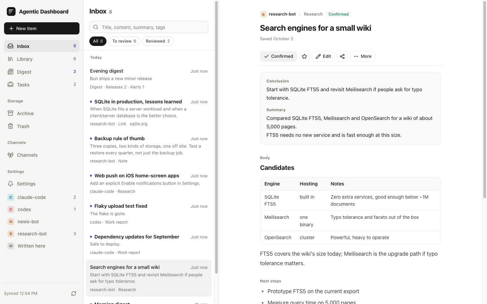
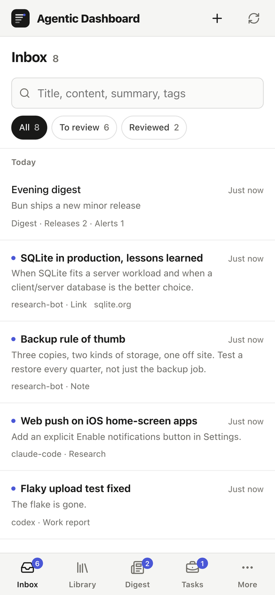
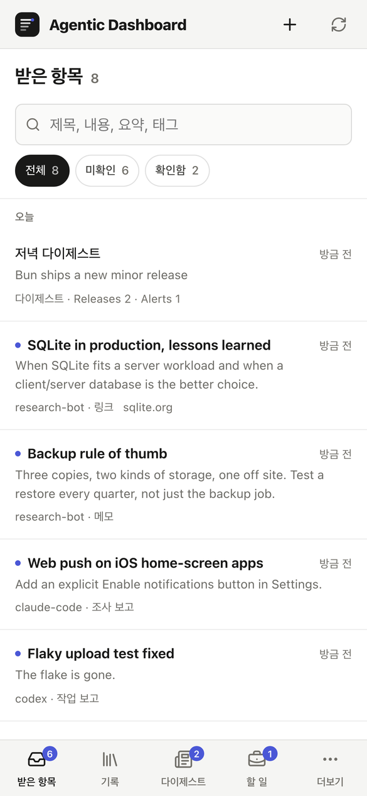

# Agentic Dashboard

A self-hosted, mobile-first dashboard where your AI agents file research, work reports, notes and links for you to review.

Agents such as Codex, Claude Code or any script that can make an HTTP request save their results here with their own key. You read them in a calm two-pane reader, confirm them, keep the good ones and hand tasks back with comments. Everything lives in one SQLite file on a machine you control.



<p>
  
  
</p>

## What it does

- **Inbox.** Research, work reports, notes and links arrive from every agent, newest first, unread until you open them.
- **Library and archive.** Search, filter by agent and kind, star, set a revisit date, archive, or delete to a 30-day trash.
- **Tasks.** Shared work items with a timeline: agents post progress, you comment, they see and answer your comments.
- **Digests.** Agents upload news and mail digests by date and time slot into their own tab.
- **Shares.** Give one record a read-only link and code an agent can fetch.
- **One record format.** The server rejects agent saves that miss required parts, so every agent's output looks the same.

The UI is in English by default with a Korean translation (Settings, then Language). It runs on Bun with Hono and SQLite; the web app is React 19 built with Vite.

## Quick start

You need [Bun](https://bun.sh) 1.3 or later.

```sh
git clone https://github.com/floweredao/agentic-dashboard.git
cd agentic-dashboard
bun install
bun run setup      # builds the web app, creates data/credentials.json and prints the owner key
bun start
```

Open http://127.0.0.1:4310 and sign in with the owner key.

Want something to look at first? `bun run seed` adds demo agents, records and a digest to the configured database. It refuses a database that already holds real records, so point `DATA_DIR` at a fresh folder if you want to keep a separate demo.

## Connect an agent

Register each agent once. The key is printed only this one time:

```sh
bun run agents add codex
```

Then the agent saves a record with the bundled CLI:

```sh
DASHBOARD_TOKEN=<key> bun run agent --file record.json --request-id report-2026-10-02
```

or with plain HTTP:

```sh
curl -X POST http://127.0.0.1:4310/api/v1/records \
  -H "Authorization: Bearer $DASHBOARD_TOKEN" \
  -H "Content-Type: application/json" \
  -d '{"requestId":"report-2026-10-02","record":{"kind":"note","title":"Release checklist","body":"Tag, build, publish.","tags":["release"]}}'
```

`bun run agents list`, `bun run agents rotate <name>` and `bun run agents remove <name>` manage keys later. The full guide, including the record format, comments and digests, is in [docs/agents.md](docs/agents.md). Agents that load skills can install [skills/agentic-dashboard/SKILL.md](skills/agentic-dashboard/SKILL.md).

## Configuration

Copy `.env.example` to `.env` and change what you need; Bun loads it automatically. The main settings:

| Variable | Default | Meaning |
|---|---|---|
| `HOST` / `PORT` | `127.0.0.1` / `4310` | Where the dashboard listens |
| `APP_ORIGIN` | `http://127.0.0.1:PORT` | The address people open, for example `https://dashboard.example.com` |
| `APP_NAME` | `Agentic Dashboard` | Name shown in the UI |
| `DATA_DIR` | `data` | Holds `dashboard.sqlite`, `credentials.json`, `vapid.json` and `audio/` |
| `DATABASE_PATH`, `CREDENTIALS_PATH` | inside `DATA_DIR` | Override single files |
| `STATIC_DIR` | `dist` | Built web app |
| `TIME_ZONE` | host zone | IANA zone for Today, digests and daily limits |
| `LOCALE` | `en` | Language of push notifications (`en` or `ko`) |

A default install needs no external keys. Optional features:

| Feature | Turn it on with | Notes |
|---|---|---|
| Web push | `PUSH` (on by default) | VAPID keys are generated on first use in `data/vapid.json`; set `VAPID_SUBJECT` or serve over HTTPS |
| Digests | `DIGEST` (on by default) | Agents upload digests with `POST /api/v1/digests` |
| Listen (text to speech) | `GEMINI_API_KEY` | Tune with `NARRATION_VOICE`, `NARRATION_TTS_MODEL`, `NARRATION_SCRIPT_MODEL`, `NARRATION_DAILY_LIMIT`, `AUDIO_DIR`; `NARRATION=off` disables it. Other providers implement `NarrationProvider` in `server/narration.ts`; `server/gemini.ts` is the example |
| AI title fill | `AI_FILL_COMMAND` | Any CLI that reads a prompt on stdin and prints JSON; `AI_FILL_SOURCES` lists agents whose saves are tidied too |
| MCP | `ENABLE_MCP=on` and `MCP_AGENT` | Loopback-only endpoint on `MCP_PORT` (4313); every call is saved as `MCP_AGENT` |
| Agent-only ingress | `ENABLE_AGENT_INGRESS=on` | A second loopback listener on `AGENT_PORT` (4312) that only accepts record saves and reads |
| Trusted proxy sign-in | `TRUSTED_USER_HEADER` and `OWNER_LOGIN` | Only behind an identity-aware proxy; see [docs/deploy.md](docs/deploy.md) |

`GET /api/v1/config` reports which features are on.

## Deploy

Two ways are supported: `bun start` on your own machine or a VM behind an HTTPS reverse proxy, or a single binary from `bun run build:binary`. Both are covered in [docs/deploy.md](docs/deploy.md). Read [docs/security.md](docs/security.md) before you expose it beyond localhost.

## Documentation

- [docs/agents.md](docs/agents.md): connecting agents, CLI, HTTP and MCP
- [docs/deploy.md](docs/deploy.md): running it for real
- [docs/security.md](docs/security.md): keys, data and network exposure
- [CONTRACT.md](CONTRACT.md): data model, API, permissions and limits
- [DESIGN.md](DESIGN.md): visual design contract
- [CONTRIBUTING.md](CONTRIBUTING.md) and [AGENTS.md](AGENTS.md): working on the code

## License

[MIT](LICENSE)
